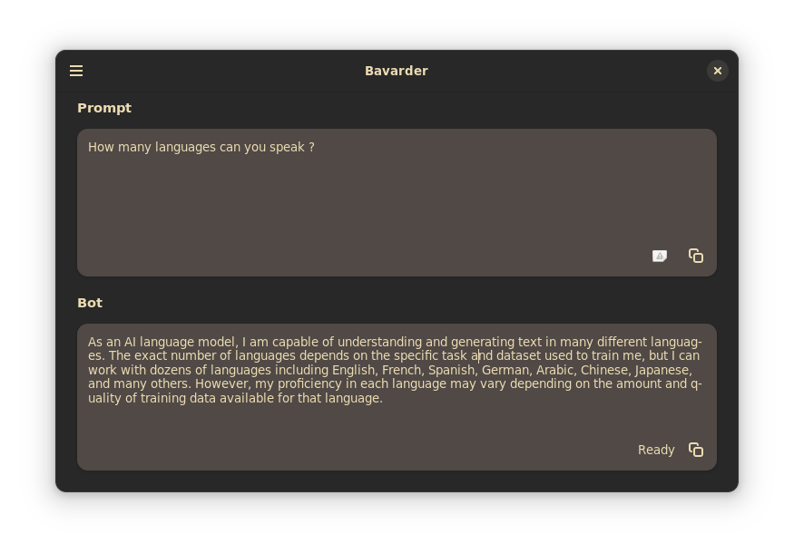

# Bavarder

Ask GPT from GNOME



## Installation

### Flatpak

#### Flathub

#### From Source

Clone the repo and run `flatpak-builder`

```
git clone https://github.com/Bavarder/Bavarder
cd Bavarder
flatpak-builder --install --user --force-clean repo/ build-aux/flatpak/com.github.Bavarder.Bavarder.json
```

